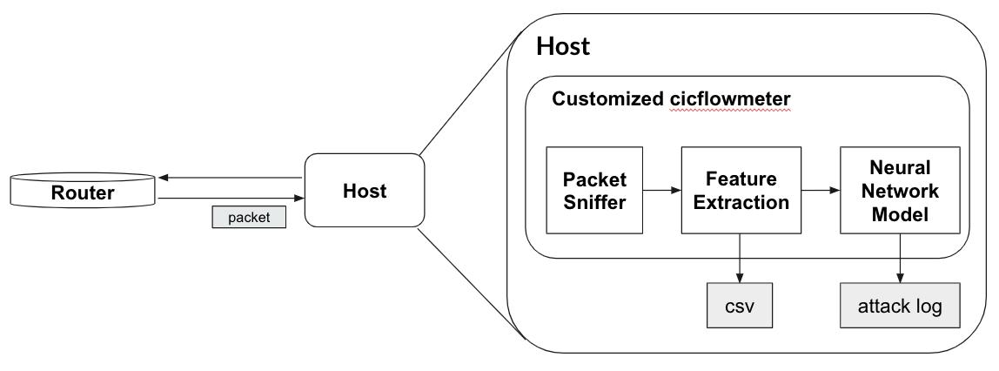

# DoS-Intrusion Detection System

This IDS(Intrusion Detection System) detects denial of service attack.  

## Process

1. cicflowmeter execution
``` 
cicflowmeter -i [wifi-name] -c flows.csv
```
2. Packet sniffer captures the packets on the router. 

3. cicflowmeter extracts the features from packet information

4. The features on real-time is an input of model.  

We used the simple neural network model. 


## Structure




## Report

https://github.com/jiniljeil/DoS-Intrusion-Detection-System/blob/master/IDS%20Final%20Report.pdf

## IDS Test

https://youtu.be/wBjDQ6sChoc

